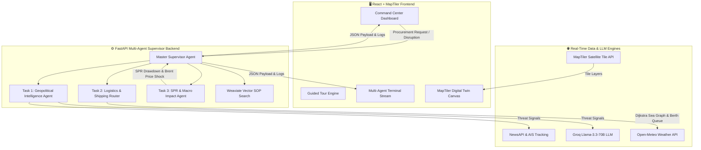

# 🛡️ EnergyShield AI — Enterprise Supply Chain Resilience Command Center

[](https://python.org)
[](https://fastapi.tiangolo.com)
[](https://react.dev)
[](https://vitejs.dev)
[](https://maptiler.com)
[](https://groq.com)
[](LICENSE)

An enterprise-grade, multi-agent AI operations command center designed for import-dependent economies (e.g., India) to safeguard national crude oil supply chains against geopolitical crises, maritime chokepoint blockages, and supply disruptions.

---

## 🌟 Key Features

* 🗺️ **MapTiler Digital Twin Canvas**: High-resolution cartographic visualization (Satellite Hybrid default) displaying export ports, import hubs, refineries, Strategic Petroleum Reserve (SPR) caverns, sea transit checkpoints, and active threat blockages.
* 🤖 **Task 1 — Geopolitical Threat Intelligence Agent**: Ingests real-time international news feeds, extracts threat severity scores via Groq Llama-3.3-70B, and identifies blocked maritime straits (Hormuz, Bab-el-Mandeb, Red Sea).
* 🚢 **Task 2 — Adaptive Logistics & Shipping Router**: Optimizes sea paths using a Dijkstra shortest-path graph engine, evaluates marine weather risks, berth queues at ports, chemical crude assay compatibility (API gravity & sulfur %), and tanker fleet charter availability.
* 🛢️ **Task 3 — Strategic Petroleum Reserve (SPR) & Macro Economic Impact**: Calculates optimal reserve drawdowns from SPR sites (Padur, Visakhapatnam, Mangalore), maintains national Days of Cover (DoC), and predicts Brent crude spot price shocks and macro GDP impact.
* 🎮 **Interactive Guided Tour Walkthrough**: Non-blocking, game-style spotlight tutorial guiding first-time users step-by-step with developer replay controls.
* ⏱️ **In-Console Execution Stream with Countdown Timer**: Live multi-agent execution stream directly inside the Orchestration Console featuring an active countdown clock.
* 📊 **Executive Decision Briefing & Architect Rationale**: Full AI explainability providing government-ready Cabinet Committee on Economic Affairs (CCEA) decision support.

---

## 📐 System Architecture



---

## ⚡ Quick Start Guide

### Prerequisites

- **Node.js** 18.0 or higher
- **Python** 3.10 or higher
- **Git**

### 1. Repository Setup

```bash
git clone https://github.com/Amey2006/EnergyShieldAI.git
cd EnergyShieldAI
```

### 2. Environment Configuration

Create a `.env` file in the root directory (or copy `.env.example`):

```bash
cp .env.example .env
```

Add your API keys to `.env`:
```ini
GROQ_API_KEY=your_groq_api_key_here
GROQ_MODEL=llama-3.3-70b-versatile
HF_TOKEN=your_hf_token_here
WEAVIATE_API_KEY=your_weaviate_key_here
WEAVIATE_CLUSTER=https://wmyvbmhast2lbrkuhjkk6w.c0.asia-southeast1.gcp.weaviate.cloud
OPENAI_API_KEY=your_openai_api_key_here
VITE_MAPTILER_API_KEY=your_maptiler_api_key_here
```

### 3. Backend Setup & Launch

```bash
# Navigate to backend directory
cd backend

# Install dependencies
pip install -r requirements.txt

# Start FastAPI server
py -m uvicorn app.main:app --reload --port 8000
```
Backend will run at: `http://127.0.0.1:8000`

### 4. Frontend Setup & Launch

Open a second terminal in the project root:

```bash
# Install Node packages
npm install

# Start Vite dev server
npm run dev
```
Frontend will run at: `http://localhost:5173`

---

## 📡 API Endpoints Summary

| Method | Endpoint | Description |
| :--- | :--- | :--- |
| `GET` | `/api/digital-twin` | Fetches digital twin network nodes, tankers, refineries & blocked straits |
| `POST` | `/api/optimize` | Triggers master multi-agent optimization pipeline (Task 1 $\rightarrow$ Task 2 $\rightarrow$ Task 3) |
| `POST` | `/api/simulate-disruption` | Injects active threat blockage scenarios into the digital twin network |
| `POST` | `/api/vector-search` | Performs vector RAG semantic search over Maritime SOP knowledge base |

---

## 🧪 Testing Suite

Run the automated Python unit test suite:

```bash
py -m unittest discover -s backend/tests
```

---

## 📜 License

Distributed under the **MIT License**. See `LICENSE` for details.
